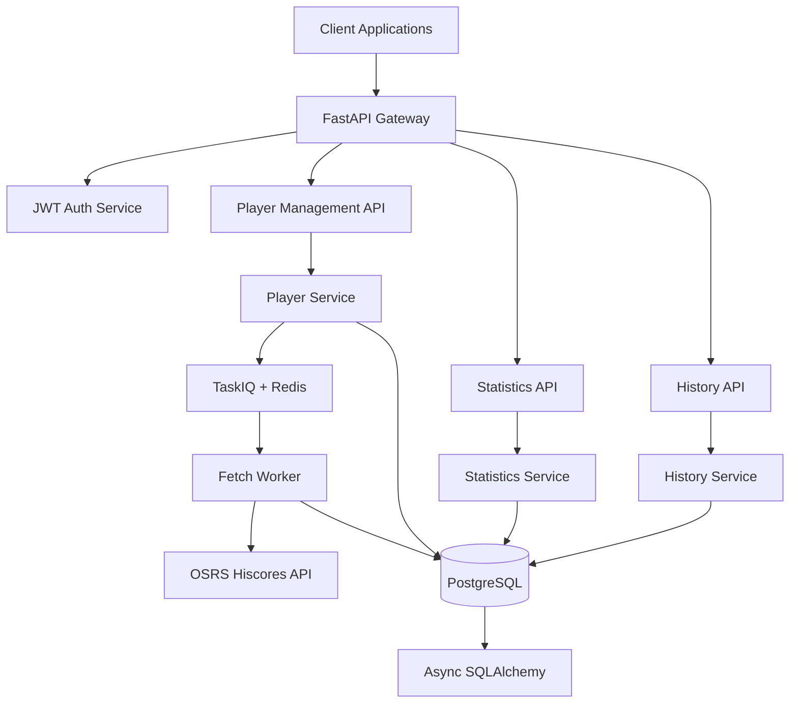

# OSRS Diff Backend Service Design

## Overview

The OSRS Diff service is built as a modern async Python backend using FastAPI, designed to track Old School RuneScape character progression through periodic hiscore data collection. The architecture emphasizes functional programming patterns, async operations, and clean separation of concerns across API, business logic, and data persistence layers.

## Architecture

### High-Level Architecture



### Technology Stack

- **API Layer**: FastAPI with async endpoints
- **Authentication**: JWT with configurable expiration
- **Task Queue**: TaskIQ with Redis broker
- **Database**: PostgreSQL with async SQLAlchemy
- **HTTP Client**: aiohttp for OSRS API calls
- **Validation**: Pydantic models for request/response validation

## Components and Interfaces

### 1. API Gateway Layer

**FastAPI Application Structure:**
```python
# Main application with middleware stack
app = FastAPI(
    title="OSRS Diff API",
    description="Track OSRS character progression",
    version="1.0.0"
)

# Middleware: CORS, JWT validation, request logging
# Router modules: players, statistics, history, auth
```

**Core Endpoints:**
- `POST /auth/login` - JWT token generation
- `POST /auth/refresh` - Token refresh
- `POST /players` - Add player to tracking
- `DELETE /players/{username}` - Remove player
- `POST /players/{username}/fetch` - Manual fetch trigger
- `GET /players/{username}/stats` - Current statistics
- `GET /players/{username}/history` - Historical progress
- `GET /players` - List all tracked players

### 2. Authentication Service

**JWT Implementation:**
```python
class AuthService:
    async def create_token(self, user_data: dict) -> str
    async def validate_token(self, token: str) -> dict
    async def refresh_token(self, refresh_token: str) -> str
```

**Security Features:**
- Configurable token expiration (access: 15min, refresh: 7 days)
- Token blacklisting for logout
- Rate limiting on auth endpoints
- Secure password hashing with bcrypt

### 3. Player Management Service

**Core Operations:**
```python
class PlayerService:
    async def add_player(self, username: str) -> Player
    async def remove_player(self, username: str) -> bool
    async def get_player(self, username: str) -> Optional[Player]
    async def list_players(self) -> List[Player]
    async def trigger_manual_fetch(self, username: str) -> TaskResult
```

**Validation Logic:**
- Username format validation (OSRS naming rules)
- Duplicate prevention
- OSRS API existence check before adding

### 4. Statistics Service

**Data Retrieval:**
```python
class StatsService:
    async def get_current_stats(self, username: str) -> Optional[HiscoreRecord]
    async def get_multiple_stats(self, usernames: List[str]) -> Dict[str, HiscoreRecord]
    async def get_stats_at_date(self, username: str, date: datetime) -> Optional[HiscoreRecord]
```

**Response Formatting:**
- Structured skill data (level, experience, rank)
- Boss kill counts with rankings
- Metadata (last updated, data freshness)

### 5. History Service

**Progress Analysis:**
```python
class HistoryService:
    async def get_progress_between_dates(
        self, username: str, start_date: datetime, end_date: datetime
    ) -> ProgressAnalysis
    
    async def get_skill_progress(
        self, username: str, skill: str, days: int
    ) -> SkillProgress
    
    async def get_boss_progress(
        self, username: str, boss: str, days: int
    ) -> BossProgress
```

**Analysis Features:**
- Experience gains calculation
- Level progression tracking
- Boss kill count changes
- Rate calculations (XP/day, kills/day)
- Trend analysis for long-term progress

### 6. Fetch Worker Service

**Background Task Processing:**
```python
class FetchWorker:
    async def fetch_player_hiscores(self, username: str) -> HiscoreRecord
    async def process_scheduled_fetches(self) -> None
    async def handle_fetch_retry(self, username: str, attempt: int) -> None
```

**OSRS API Integration:**
- Async HTTP client with connection pooling
- Rate limiting compliance (1 request per 2 seconds)
- Retry logic with exponential backoff
- Error handling for API unavailability
- Data parsing and validation

## Data Models

### Database Schema

**Players Table:**
```sql
CREATE TABLE players (
    id SERIAL PRIMARY KEY,
    username VARCHAR(12) UNIQUE NOT NULL,
    created_at TIMESTAMP WITH TIME ZONE DEFAULT NOW(),
    last_fetched TIMESTAMP WITH TIME ZONE,
    is_active BOOLEAN DEFAULT TRUE,
    fetch_interval_minutes INTEGER DEFAULT 60
);
```

**Hiscore Records Table:**
```sql
CREATE TABLE hiscore_records (
    id SERIAL PRIMARY KEY,
    player_id INTEGER REFERENCES players(id),
    fetched_at TIMESTAMP WITH TIME ZONE DEFAULT NOW(),
    overall_rank INTEGER,
    overall_level INTEGER,
    overall_experience BIGINT,
    -- Skills (23 skills)
    attack_rank INTEGER, attack_level INTEGER, attack_experience BIGINT,
    defence_rank INTEGER, defence_level INTEGER, defence_experience BIGINT,
    -- ... (other skills)
    -- Bosses (50+ bosses)
    abyssal_sire_rank INTEGER, abyssal_sire_kc INTEGER,
    alchemical_hydra_rank INTEGER, alchemical_hydra_kc INTEGER,
    -- ... (other bosses)
);
```

**SQLAlchemy Models:**
```python
class Player(Base):
    __tablename__ = "players"
    
    id: Mapped[int] = mapped_column(primary_key=True)
    username: Mapped[str] = mapped_column(String(12), unique=True)
    created_at: Mapped[datetime] = mapped_column(default=func.now())
    last_fetched: Mapped[Optional[datetime]]
    is_active: Mapped[bool] = mapped_column(default=True)
    fetch_interval_minutes: Mapped[int] = mapped_column(default=60)
    
    hiscore_records: Mapped[List["HiscoreRecord"]] = relationship(back_populates="player")

class HiscoreRecord(Base):
    __tablename__ = "hiscore_records"
    
    id: Mapped[int] = mapped_column(primary_key=True)
    player_id: Mapped[int] = mapped_column(ForeignKey("players.id"))
    fetched_at: Mapped[datetime] = mapped_column(default=func.now())
    
    # Overall stats
    overall_rank: Mapped[Optional[int]]
    overall_level: Mapped[Optional[int]]
    overall_experience: Mapped[Optional[int]]
    
    # Skills and bosses as JSON columns for flexibility
    skills_data: Mapped[dict] = mapped_column(JSON)
    bosses_data: Mapped[dict] = mapped_column(JSON)
    
    player: Mapped["Player"] = relationship(back_populates="hiscore_records")
```

### Pydantic Models

**Request/Response Models:**
```python
class PlayerCreateRequest(BaseModel):
    username: str = Field(..., min_length=1, max_length=12, pattern=r'^[a-zA-Z0-9 _-]+$')

class PlayerResponse(BaseModel):
    id: int
    username: str
    created_at: datetime
    last_fetched: Optional[datetime]
    is_active: bool

class HiscoreStatsResponse(BaseModel):
    username: str
    fetched_at: datetime
    overall: OverallStats
    skills: Dict[str, SkillStats]
    bosses: Dict[str, BossStats]

class ProgressAnalysisResponse(BaseModel):
    username: str
    period_start: datetime
    period_end: datetime
    experience_gained: Dict[str, int]
    levels_gained: Dict[str, int]
    boss_kills_gained: Dict[str, int]
    daily_rates: Dict[str, float]
```

## Error Handling

### Error Categories and Responses

**Authentication Errors:**
- 401 Unauthorized: Invalid/expired JWT
- 403 Forbidden: Insufficient permissions

**Validation Errors:**
- 400 Bad Request: Invalid input data
- 422 Unprocessable Entity: Pydantic validation failures

**Business Logic Errors:**
- 404 Not Found: Player/resource doesn't exist
- 409 Conflict: Player already exists
- 429 Too Many Requests: Rate limiting

**External Service Errors:**
- 502 Bad Gateway: OSRS API unavailable
- 503 Service Unavailable: Database/Redis connection issues

### Error Response Format

```python
class ErrorResponse(BaseModel):
    error_code: str
    message: str
    details: Optional[dict] = None
    timestamp: datetime
    request_id: str
```

### Retry and Circuit Breaker Patterns

**OSRS API Circuit Breaker:**
- Open circuit after 5 consecutive failures
- Half-open state after 30 seconds
- Exponential backoff: 2s, 4s, 8s, 16s, 32s

**Database Retry Logic:**
- Transient error detection
- Maximum 3 retry attempts
- Jittered exponential backoff

## Testing Strategy

### Unit Testing

**Test Coverage Areas:**
- Service layer business logic
- Data model validation
- Authentication token handling
- Progress calculation algorithms
- OSRS API response parsing

**Testing Tools:**
- pytest with async support
- pytest-asyncio for async test fixtures
- Factory Boy for test data generation
- Freezegun for time-based testing

### Integration Testing

**Database Integration:**
- Test with real PostgreSQL (testcontainers)
- Migration testing
- Transaction rollback testing
- Connection pool testing

**API Integration:**
- FastAPI TestClient for endpoint testing
- JWT token flow testing
- Request/response validation
- Error handling verification

**External Service Testing:**
- Mock OSRS API responses
- Network failure simulation
- Rate limiting behavior
- Timeout handling

### Performance Testing

**Load Testing Scenarios:**
- Concurrent API requests
- Background task processing
- Database query performance
- Memory usage under load

**Monitoring Metrics:**
- Response time percentiles
- Database connection utilization
- Task queue depth
- Error rates by endpoint

### Test Data Management

**Fixtures and Factories:**
```python
@pytest.fixture
async def test_player():
    return await PlayerFactory.create(username="test_player")

@pytest.fixture
async def mock_osrs_response():
    return {
        "overall": {"rank": 1000, "level": 1500, "experience": 50000000},
        "attack": {"rank": 500, "level": 99, "experience": 13034431}
    }
```

**Database Seeding:**
- Realistic test data generation
- Historical data for progress testing
- Edge case scenarios (missing data, API failures)

This design provides a robust, scalable foundation for the OSRS Diff service while maintaining clean architecture principles and leveraging modern Python async capabilities.